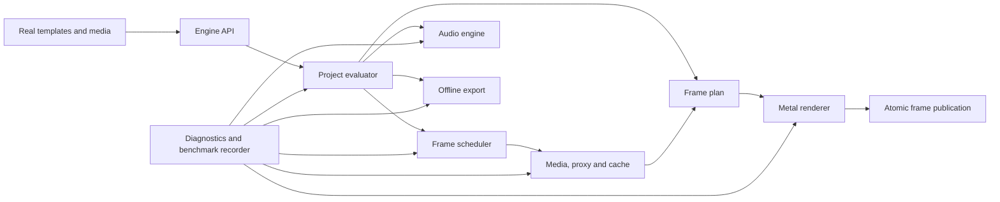

# AnimiEngineNext Canonical Architecture Proposal

Status: **FOUNDATION APPROVED - remaining technical details stay gated**

## 1. Goal

Build a new local iOS video engine from scratch, beside the current engine,
without changing or gradually migrating the current implementation.

The new engine must:

- load real Animi templates with their existing animations;
- support scene composition, global overlays and scene transitions;
- preview and scrub projects without stale, mixed or partial frames;
- support frequent 10-video scenes and rare 20-video scenes;
- support animated text, audio and deterministic export;
- target 1080x1920 SDR at 30 fps first;
- be structurally ready for 60 fps, 4K, HDR, alpha and other canvas sizes;
- expose all tunable performance choices through configuration;
- produce evidence for every performance or quality decision.

Development initially has no product UI. It uses automated tests and a minimal
device test host only.

## 2. Non-goals

- Modifying the current playback or export engine.
- Incrementally replacing current product modules.
- Integrating the new engine into the product before it passes its gates.
- Choosing device-dependent constants by opinion.
- Building a cloud backend.

## 3. Approved product rules

These rules are already approved by the product owner:

1. The new engine is developed independently beside the current engine.
2. The current product remains untouched during engine development.
3. Functional testing begins without product UI.
4. Existing real templates and animations are mandatory test inputs.
5. The system must support compositions containing up to 20 animated videos.
6. A centered transition uses the end of the outgoing scene and the beginning
   of the incoming scene.
7. During a slide transition, the outgoing scene continues playing until the
   transition completes.
8. Under overload, the whole preview rate decreases together. Individual video
   layers must not randomly freeze while others continue at full rate.
9. Tunable behavior must be configurable and quickly comparable.
10. Tests, structured logs and measurements are mandatory.
11. A technical change is accepted only when evidence supports it.
12. New technical decisions require explicit owner approval.

## 4. Proposed system boundary

**Proposal A-01:** create an independent Swift package named
`AnimiEngineNext`, plus a minimal iOS benchmark host.

The package must not import `AnimiApp` or use the current editor runtime,
playback providers, timeline engine or exporter.

The benchmark host exists only because Metal, VideoToolbox, AVFoundation,
memory and thermal behavior must be measured on physical iPhones. It has no
product interface.



## 5. Proposed modules

### 5.1 Engine API

The only public entry point.

Responsibilities:

- open and close a project;
- prepare a project;
- request playback, pause, scrub and exact settle;
- request export;
- expose progress and typed failures;
- never expose decoder or renderer internals.

### 5.2 Project Model

Immutable, versioned project description.

Contains:

- project settings and canvas;
- rational project frame rate;
- scene sequence;
- global overlays and audio;
- scene transitions;
- template and media references;
- user placement and trim state.

The new model is not required to match the current persisted `ProjectDraft`.
Compatibility is handled by an adapter outside the engine.

### 5.3 Template Runtime Adapter

Loads existing real templates without depending on the old playback engine.

Two options require approval:

- read existing compiled `.tve` packages through an isolated adapter;
- define a new compiled format and update the template compiler.

The first option is recommended for initial validation because it preserves the
actual template animation behavior and reduces unrelated work.

### 5.4 Time System

Provides one exact time model for timeline, source media, audio and export.

Required properties:

- no floating-point time as canonical state;
- exact rational frame-rate representation;
- deterministic conversion and rounding;
- support for 29.97, 30, 59.94 and 60 fps;
- source-native timestamps for VFR media;
- explicit frame and audio-sample mapping.

The concrete stored representation requires approval through an ADR.

### 5.5 Project Evaluator

Pure deterministic logic that converts:

```text
project snapshot + requested project time + quality profile
```

into an immutable `FramePlan`.

It determines:

- active scenes and transition progress;
- scene-local and source-media times;
- visible layers and exact order;
- text, sticker and effect state;
- audio automation state;
- required media frames;
- allowed quality substitutions.

It performs no decoding, rendering or file I/O.

### 5.6 Frame Scheduler

The single authority for realtime frame work.

It owns:

- preview clock and frame deadlines;
- playback epoch and request identity;
- decoder grants and bounded queues;
- cancellation and latest-request-wins behavior;
- prewarming and backpressure;
- source/proxy/cache selection;
- global preview-rate changes;
- memory and thermal responses.

No video layer may independently publish a visible frame.

### 5.7 Media Decode Layer

One backend-neutral interface for requesting timestamped frames.

Potential implementations:

- AVFoundation player-output backend;
- direct VideoToolbox backend;
- AVAssetReader backend for offline work.

The interface is canonical. The winning realtime backend is selected by
physical-device benchmarks.

### 5.8 Proxy System

Generates and manages project-local preview media.

All choices are configurable:

- codec;
- resolution levels;
- bitrate or quality;
- GOP structure;
- pixel format;
- audio inclusion;
- generation concurrency;
- storage limits.

The default codec and levels are benchmark decisions, not architecture
assumptions.

### 5.9 Render Cache

Stores reusable flattened scene or transition ranges.

Cache identity must include:

- immutable project/content revision;
- dependency hash;
- time range;
- quality profile;
- render semantics version;
- color configuration.

Request generation IDs are not cache identity. They only prevent outdated
requests from publishing.

Configurable choices include chunk length, format, resolution, generation
policy, disk budget and eviction.

### 5.10 Metal Renderer

Consumes an immutable `FramePlan` and produces one complete composed frame.

Required properties:

- deterministic layer order;
- scene and transition subplans;
- masks, mattes, effects and animated template content;
- explicit color information;
- pooled textures and pixel buffers;
- bounded frames in flight;
- explicit resource ownership;
- shared preview/export semantics;
- atomic final publication.

The renderer may lower preview quality but may not change project timing.

### 5.11 Text Engine

Provides identical layout and animation meaning in preview and export.

The exact implementation, including whole-block textures versus glyph atlas,
is selected after tests using the required 10 animated text-block scenario.

### 5.12 Audio Engine

Provides:

- synchronized preview;
- video-layer audio independent of visual visibility;
- project music and global audio;
- shared automation rules;
- deterministic offline export mix;
- interruption and route-change handling.

The master-clock design and internal sample rate require an ADR and evidence.

### 5.13 Export Engine

Performs deterministic offline evaluation. It is not a recording of preview.

It must:

- use original media;
- evaluate every output frame explicitly;
- use the same project evaluator and rendering semantics as preview;
- use bounded resource concurrency;
- produce deterministic timestamps and audio alignment;
- stop with a clear asset-specific error on missing or corrupt media;
- write output atomically.

### 5.14 Diagnostics and Benchmark System

A mandatory engine subsystem, not optional debug code.

It records:

- complete configuration;
- device and OS;
- template, project and media identities;
- every scheduler decision;
- frame request and publication lifecycle;
- decode, upload, planning, CPU and GPU durations;
- queue depth and active decoder count;
- proxy and cache decisions;
- memory and thermal state;
- dropped, late, cancelled and rejected frames;
- audio/video synchronization;
- export output and failures.

## 6. Identity model

The system needs separate identities for separate purposes:

- `ProjectRevision` - immutable content version;
- `PlaybackEpoch` - invalidated by play, seek, scrub or edit state changes;
- `FrameRequestID` - one requested composed frame;
- `MediaRequestID` - one requested source frame;
- `CacheArtifactID` - reusable cache content;
- `ExportJobID` - one offline export operation;
- `BenchmarkRunID` - one reproducible test run.

This avoids incorrectly using one generation counter for unrelated jobs.

## 7. Frame publication contract

The visible output changes only after:

1. the evaluator creates a complete plan;
2. required media or approved fallbacks are resolved;
3. all resources match the active project revision and playback epoch;
4. the complete frame is rendered;
5. identity is validated again;
6. the complete frame is published atomically.

Stale, partial and mixed-revision frames are always forbidden.

## 8. Transition contract

The approved visual behavior is:

- transition is centered on the scene boundary;
- transition does not change the total project duration;
- outgoing and incoming scenes both remain time-active during the overlap;
- slide keeps the outgoing scene playing until completion;
- global overlays remain above the transition.

The project evaluator must represent scene transition handles explicitly. It
must not silently clamp the outgoing scene to a frozen final frame when the
approved transition requires continued animation.

The exact internal mapping of those transition handles to template animation
time and source-media time is defined in ADR-004. That ADR must preserve the
approved visible behavior above.

## 9. Overload contract

The approved order starts with:

1. keep all timing synchronized;
2. reduce internal resolution or select lower proxies;
3. use valid scene/transition cache;
4. reduce the global preview rate from 30 to 24, then 15 fps;
5. stop safely if correctness still cannot be maintained.

Random per-layer temporal freezing is not part of the approved policy.

The exact ordering of resolution, proxy and cache substitutions is configurable
and benchmarked.

## 10. Real-template compatibility

The current mandatory real-template suite is:

| Template | Media blocks | Animation coverage |
|---|---:|---|
| `full_image` | 1 | static and animated |
| `polaroid_shared_demo` | 1 | static and animated |
| `polaroid_2` | 2 | static and animated |
| `example_4blocks` | 4 | multiple animated variants |
| `6_frames_template` | 6 | static block layout |

These templates do not prove 10/20-video performance. Dedicated 10- and
20-video stress templates are additionally required, while the real templates
remain mandatory for behavior compatibility.

## 11. Concurrency and ownership proposal

Recommended boundaries, pending approval:

- project evaluation: pure synchronous values;
- engine control and scheduler: one serialized actor;
- each decode backend: owned worker context with bounded requests;
- proxy/cache generation: separate bounded background workers;
- Metal submission: one renderer-owned queue;
- audio: dedicated realtime-safe audio path;
- export: isolated job context;
- diagnostics: nonblocking event sink with bounded buffering.

No callback may mutate visible state directly.

## 12. Development gates

1. Architecture approval.
2. Empty isolated package and evidence system.
3. Deterministic project/time/evaluation core.
4. Real-template static frame rendering.
5. Realtime scheduler and decode experiments.
6. Proxy and cache experiments.
7. Audio and text parity.
8. Deterministic export.
9. 10/20-video stress and soak tests.
10. Product-integration decision.

Passing a gate requires stored test evidence. It does not mean integrating any
part into the current product.
